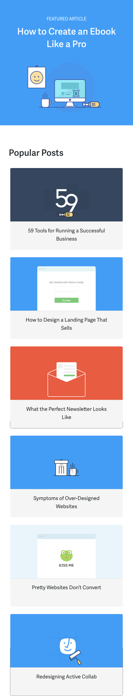

% Essential Tools for Running a Business
% Aleksandar Olic
% &copy; 2016 A51

# Before We Start...

As a software company, we need tools to collaborate, code, promote our product, and support our customers. This book lists every tool we use and how it helps us.

The list is a result of running a business for over 9 years. We started off with only a few basic tools, mainly for coding; as we grew, our needs grew with us: we needed to improve how we track our marketing campaigns, create designs and content, organize our work, and automate repetitive tasks.

Some tools are free, some we pay for. To save you some time, we mark if there's a free plan and the price of a starter paid plan. The ones with a price tag are definitely worth it - they help us get the job done and make money. So when we pay $400 a month for a tool, we are getting our ROI. 

You’ll find a lot of different platforms: from web based apps, browser extensions, and command-line programs, to desktop and mobile apps. We mostly use Macs, but most tools on the list are web based, so it shouldn't be a problem if you're on Windows or Linux.
 
The left page has basic information about the tool while the right one has a real-life screenshot of and a short comment on how we use it. 

You’ll notice we use a lot of tools that have the same functionality — that’s both because each has its unique purpose and people on our team have different preferences.

We’re sure there are many more great tools out there. The ones on the list are what we’ve tried out so far. If you think we left something out, tell us and we'll check them out - maybe even include them in an update.

We hope you find something that’ll help you with your particular challenge, or just inspire you to try out a few new apps.

## About Us

We are A51, the company behind Active Collab. We're privately owned, 30 people strong, and have over 9 years of experience in developing project management software. As simple as that. 

Active Collab began as a successful open-source project, which later grew to be a very successful commercial product. All we care about is developing exceptional software and making Active Collab the best project management tool in the world.

# Collaboration Tools

## Active Collab

**Project management**

\

To keep up with our to-dos and work-related tasks that involve more than two people, we use Active Collab. 

Active Collab is our main information hub, while other tools act as support. We keep a separate project for everything:

- All the reported bugs and feature requests
- Work in progress
- One for each product (Timer, Android, iOS, SupportYard)
- One for each team or process (support, marketing, management, HR) 
- Other things (UX, blog, analytics)

By looking at the My Work page, everyone knows what to do next.  It keeps track of our assignments and notifications for tasks we're subscribed to.

To get an update on everything that happened the day before, we scan the global Activity page. It lists every new comment, task, status update, and more.

Notes are good for saving important information that’s accessed semi-regularly (release notes, workflow guidelines, and feature suggestions).

Active Collab also has time tracking and invoicing features, but we don't use them because we don’t do client work or charge by the hour.

\
\


>**A separate project for work in progress**\
A separate project for work in progress
We splitted to-dos across two projects - in one we put stuff we're currently working on, and in the other what we need to do in the future. This helps us focus on the work at hand, separating what we’d like to work on from what really needs to be done.

\


>**A task keeps everything in one place**\
We discuss work and keep each other in the loop through task comments. When we need a fast reply, we use @mentions to get someone’s direct attention.

\

```
Platform:
• Web based
• iOS, Android

Price:
• $25/month/5 users
• $499 self-hosted
```

*[https://www.activecollab.com/](https://www.activecollab.com/)*

## Slack 

**Chat**

\

Slack lets us quickly and informally message each other.

That way we don't have to overburden Active Collab with disposable information that has a short lifespan.

We chat in channels divided by interests like #support, #management, #dev, #builds, #feather, and #marketing. 

We also have a #chitchat and #general channel for banter, birthdays, funny links, and questions (like where to buy good barbecue or how to extend a personal ID card). 

Direct messages are good for quickly sharing a file or a piece of text - we just drag and drop a file and the person gets a notification so they can download it. 

Channels, on the other hand, are good for sharing updates and getting instant answers to burning questions (like which account needs technical assistance or what’s the ETA for some feature).

We use the Slack desktop app so we can hit cmd+tab to open it quickly and see a notification. But if we're away from our work computer, we can always access Slack through a browser or a mobile app.

\
\


>**Sharing updates with the team**\
We share updates about new features on a public channel to keep everyone on the team in the loop.

\

```
Platform:
• Web based
• Windows, Mac, Linux
• iOS, Android

Price:
• Free
• $9.99/user/month
```

[https://slack.com/](https://slack.com/)


## Dropbox 

**File storage**

\

Dropbox is great for working together on the same files and accessing them regardless what computer we’re on. 

We have a common Dropbox folder where we put all our designs so they’re accessible to everyone. This saves us from sending files back and forth whenever there’s an updated version.

Dropbox, when installed on a computer, creates a folder that behaves like any other folder: you can copy, delete, and edit files, and those actions will be applied across all other computers which have that folder.

We also use Dropbox for storage. If we need to share a file with someone who's not authorized to access the folder, we can always right-click on the file, copy the weblink, and share it. This way, the recipient has access only to the file they asked for.

\
\


>**Same files across computers**\
Everyone has access to the folder with the design files on their own computer. It's automatically updated whenever there's a new file version. This way, there's no back-and-forth file sharing and wondering if you're working on an outdated version.

\


>**Access files without installation**\
If you're away from your computer, you can log in to the Dropbox website and access all your files from a browser.

\

```
Platform:
• Web based
• Windows, Mac, Linux
• iOS, Android

Price:
• Free
• $8/user/month
```

*[https://www.dropbox.com/](https://www.dropbox.com/)*

## QuickTime

**Video capture**

\

We use QuickTime to record bugs and show developers what the problem looks like. 

Sometimes bugs are difficult to describe, or it’s just much quicker to see the bug in action rather than read/write about it. Images don't show cause-and-effect relationship and that often leaves video as the best solution.

We shoot the video of the screen and upload it to Active Collab as an attachment on the  task related to the bug. The developer or QA can then quickly see how to reproduce the bug.

QuickTime is great for making disposable videos that don’t require further editing or polishing for marketing. 

It’s also great for capturing both desktop footage as well as iPhone/iPad screens.

\
\


>**Running QuickTime is easy**\
All you have to do is start a new screen recording and press Record. Then you can upload the file wherever you want.

\


>**QuickTime .mov files are great attachments**\
The file size is small so we can quickly attach and download them. The video quality is still excellent so we can see the interface text clearly.


\

```
Platform:
• Mac

Price:
• Free
```

*[http://www.apple.com/quicktime/](http://www.apple.com/quicktime/)*

## Google Docs

**Collaborative writting**

\

We use Google Docs for collaborative writing and proofreading (eg. blog posts, help articles, and this ebook). 

It works like a usual word processor, only there aren’t any files on our computers - just links we share. This means there’s no sending files back-and-forth or wondering if you’re working on the latest version. 

We create a new document and share the link in Active Collab or Slack. Then people can make hard and soft edits (soft ones need to be approved), or just highlight words and leave comments, like we do on book margins.

You can even see where someone's cursor is or what word they highlighted (good to make sure your writing doesn’t overlap when multiple people are working on the same document).

We also use Google Docs for storing and sorting large amounts of information that need a clear hierarchy and visual cues for fast scanning. A good example is customer feedback: less relevant information is light gray, and important bits are black.

And the best thing about Google Docs is there’s no installation: it doesn’t matter what computer your coworker uses; as long as they have a browser, everything works.

\
\


>**Perfect for proofreading**\
People can make edits (which get approved or rejected), changes are easy to see, and we don’t have to install anything.

\

```
Platform:
• Web based
• iOS, Android

Price:
• Free
```

*[https://www.google.com/docs/](https://www.google.com/docs/)*

## Google Sheets

**Online spreadsheets**

\

We use Google Sheets for tracking and analysing complex data.


Like Google Docs, you edit the spreadsheet in the browser and there’s a link to it so everyone has the latest version . The rest is almost like Excel, except it's free, your coworkers don't have to install anything, and it works on every computer.

Google Sheets is great for keeping complex information in one place. We keep all kinds of data in it: survey results, feature requests, a list of people who want to be notified when a certain feature is released, etc. 

For example, we have a form our agents fill out when users leave feedback. Every piece of info is added to the spreadsheet with the user contact info and categorized by type. This helps us measure which features are most frequently requested and decide what to work on next..

So when we decided to improve how Active Collab works with files, we just filtered the spreadsheet for anything containing the word “file” and contacted our users for use cases. This way we develop features based on real-life feedback and deliver software that solves actual problems. 

\
\


>**Survey results are easy to scan**\
We color code information so we can quickly scan and absorb information. Thanks to conditional formatting and charts, we can analyse surveys and use the knowledge to improve our sign-up rate.

\

```
Platform:
• Web based
• iOS, Android

Price:
• Free
```

*[https://www.google.com/sheets/](https://www.google.com/sheets/)*

## DokuWiki

**Knowledge Base**

\

We use DokuWiki as our internal knowledge base.

It’s an open-source project we downloaded and installed on our server so only people on our company network can access it through a browser. 

We keep all our FAQs and useful information  in it— like links to the tools and accounts we use, survey results, support guidelines, coding style guides, how-to instructions, etc.

DokuWiki holds only core, evergreen knowledge. Information is sorted and nested under different categories so finding the right information is quick and easy. 

We use wiki when we need to refresh our memory on how to do something we don’t do every day (like migrating big cloud accounts). Or when a new developer joins the team, we can give them a link to our wiki article that explains how the backend works or how to set up a MySQL database that works with Ansible.

Writing wiki articles requires special wiki syntax, but that's really easy to learn.

\
\


>**Must-know essentials in one place**\
A lot of information is scattered across other apps, from Active Collab to various docs and chat rooms. But the really important things are always close at hand in our wiki.

\

```
Platform:
• Web based

Price:
• Free self-hosted
```

*[https://www.dokuwiki.org/](https://www.dokuwiki.org/)*

# Support Tools

## SupportYard

**Help desk**

\

Our main support tool that we use to reply to customer emails is SupportYard.

It helps us assign to our support agents all the email we get and then respond to quickly. It's one of the reasons we get feedback like:
"Thanks for replying so fast, I never met support team that fast, nor Basecamp or another web product. You really have quality stuff and staff :)"
 
Every email that's sent to support@activecollab.com appears in SupportYard and is marked as “New”. When a support team member sees the new ticket, they take it so no email goes unanswered.

After they respond, the ticket is automatically marked as “Replied”; if there’s no more activity, we mark it as “Closed”. This way we can prioritize our work and see what needs our attention.

We receive all kinds of email: questions about downloading the Timer, bug reports, account management, payments, feedback, feature requests, installation assistance, login issues, business proposals, upgrade instructions, workflow suggestions - just to name a few.

The integration with Active Collab will soon let us connect tasks and tickets. So for example, when we receive a bug report, we can test it and turn it into a task in Active Collab. After our developers fix the bug, the ticket gets updated so our agents know they can notify the client.


>**All email organized in one place**\
We can see all the messages in SupportYard and assign them to someone on the team. We have saved filters that list all the tickets in one place, like all the Tech tickets marked as urgent that need a prompt reply.

\


>**It's just like regular email**\
When we reply to a customer email, they receive a new email in their inbox. There's no interface to learn like in  corporate-grade ticketing systems - everything works as they're used to. 

\
\

```
Platform:
• Web based

Price:
• Free
• $25/month/5 users
```

*[https://supportyard.com/](https://supportyard.com/)*

## LiveChat

**Customer chat**

\


We talk to our website visitors in real time using LiveChat. 

Setup is very easy - you just copy/paste a piece of code on your website, install the desktop app for support agents, and you’re ready to chat with your customers. Visitors can then ask you anything right on the spot and get instant answers.

It’s like when some people walk into a store and prefer to browse on their own, while others ask the salesperson about the product. LiveChat is there for those who prefer interaction with a real person. 

It also lets us be proactive - if they're on the Pricing page, a pop-up appears after 30 seconds asking "Do you need help figuring out the price?", or if they're on the Features pages "Any particular feature you're looking for?".

We treat each chat as an opportunity to connect with our customers, familiarize them with Active Collab, and leave a good impression.

Chats are also a good source of web design improvements. After we design a landing page, we can see what kind of questions keep popping up. They tell us what’s missing and what we can explain better. The feedback we get helps us improve the landing page and the conversion rate..

\
\


>**A visitor asks us a question**\
While a visitor is browsing, a pop-up asks if they need any help. If they're looking for a specific piece of info, they can get it faster by asking us.

\


>**Starting a conversation with potential buyers**\
Our support team can see what page they're on and from which country. Then we can help them with anything they need.

\

```
Platform:
• Web based
• Windows, Mac
• iOS, Android

Price:
• $16/user/month
```

*[https://www.livechatinc.com/](https://www.livechatinc.com/)*

## Skype + Zaplee

**Free calls**

\

For one-on-one calls, we use our Skype account that’s connected to a toll-free Zaplee number. 

Customers can call us for free if they’re in the United States, and it costs us just 2.3¢ per minute.

We can also receive regular Skype calls, which is a good option for anyone outside of the US.

Having phone support assures customers they can talk to a real person - something that’s often absent in the world of software.. It’s also comforting in case there’s an urgent technical problem and they want to check up on the status of their ticket. So having a telephone number is important, even if it's not used all that much. 

\
\


>**Telephone calls via Skype**\
Customers can call our toll free number during our office hours. Or they can reach us on Skype by calling directly from the app.

\

```
Platform:
• Windows, Mac, Linux
• iOS, Android

Price:
• $10/month + 2.3¢/min
```

*[http://www.skype.com/](http://www.skype.com/)*

*[http://zaplee.com/](http://zaplee.com/)*

## YouCanBook.me

**Booking**

\

Our customers can a book a personalized webinar by using YouCanBook.me.

We hold webinars to help onboard our users and show them around Active Collab. To schedule a webinar, all they need to do is pick an available date on YouCanBook.me. 

Then they fill out a form to tell us about their requirements so we can personalize the webinar. This way, webinars are engaging and relevant to their line of work. 

The booking process is very easy. YouCanBook.me makes sure people don’t book the same time slot and also takes care of managing time zones - every user sees the available times in their own time. It also sends a reminder before the webinar to make sure neither party forgets.

\
\


>**Picking a date is easy**\
A customer can pick the date when they're available for a presentation, without having to worry about the time zone.

\


>**Lets us know how to prepare**\
Before booking, we ask users about their workflow and how they plan to use Active Collab. Then we can personalize the webinar, address their needs, and show how Active Collab can help them.

\

```
Platform:
• Web based

Price:
• Free
• $16/month
```

*[https://youcanbook.me/](https://youcanbook.me/)*

## Join.me

**Hoding webinars**

\

For holding webinars and live demos, we use Join.me.


Once the customer booked a webinar and the date arrived, they gather their team and join us via the Join.me website. 

The client doesn't have to install anything - the chat and video streaming happen in the browser. However, we do need to install software on our side so we can share our desktop with the attendees.

Once everyone has joined, we can show Active Collab in action. We guide clients through the functionality, show tips and tricks, and let them ask questions.

The webinar is like a teleconference and an interactive video tutorial in one. 

Because we ask clients about their requirements upfront, we can really focus on their needs during the demo. This way we don’t waste time by showing everything in Active Collab if they're interested just in time tracking.

\
\


>**Joining is simple**\
All the client has to do is click a link and ask to join in.

\


>**Webinar from a presenter's view**\
On our side, we go through the features, describe them, and show how they work by sharing our desktop. If there's a question, we can demonstrate how something works right on the spot. There's even swap roles so clients show their screen (provided they have Join.me installed).

\

```
Platform:
• Web based
• Windows, Mac
iOS, Android

Price:
• Free
• $20/user/month
```

*[https://www.join.me/](https://www.join.me/)*

## TeamViewer

**Screensharing**

\

For screen sharing and solving technical problems, we use TeamViewer. 

From our experience, TeamViewer outperforms chat, email, or Skype for anything that requires a solution on the spot.

If you ever tried explaining a technical problem over the phone, you know it’s hard to find the right words. People have trouble using technical jargon or describing their screen, which makes it confusing for both sides. TeamViewer removes this barrier by letting you see the person’s screen over the internet and take control of their mouse/keyboard.

A client grants us access to their computer, observes what we’re doing, and works alongside. It’s like being next to them, using the same computer. 

For example, we use TeamViewer to help someone install Active Collab on their server. We can see what their database looks like, what options are enabled, and what parameters we need to change.

The client can see everything we do on their computer and take control whenever they want (for example, to enter a username or password).

\
\


>**Remote support saves time**\
After installing TeamViewer, the client gives us the parameters to access their computer. Once we connect to their computer, we can quickly solve the problem. 

\

```
Platform:
• Windows, Mac, Linux
• iOS, Android

Price:
• Free
• $519
```

*[http://www.teamviewer.com/](http://www.teamviewer.com/)*

## Skitch

**Screenshot annotation**

\

For taking and annotating screenshots, we use Skitch. 


It lets us draw on screenshots, add helpful notes, cross out what to remove, and blur certain parts to hide sensitive information. 

Skitch is great for showing clients where to click: we take a screenshot, draw an arrow, and share a link in less than a minute. 

We also use it to show developers what to change in the app. For example, when we design a new feature, we suggest improvements and send the annotated screenshot to the developer. 

Skitch is best used for creating disposable screenshots - they're fast to make and easy to share. For creating professional looking screenshots (for our website or blog), we create the interface from scratch in a vector graphics app called Sketch.

\
\


>**Useful for commenting**\
When we’re designing a new landing page, we can quickly make edits on the screenshot to suggest improvements. 

\


>**Reviewing copy for new features**\
Once we rewrite the copy, we pass the suggestions to the designers so they can update the Sketch file and hand it off to the developer.

\

```
Platform:
• Mac
• iOS

Price:
• Free
```

*[https://evernote.com/skitch](https://evernote.com/skitch)*

## aText

**Typing shortcuts**

\

aText lets us respond to chats and emails faster.

It's a typing shortcut app we have installed on our Macs. We associate frequent phrases with a trigger keyword/abbreviation. When we type an abbreviation in any text field, it's automatically expanded to a full phrase.

For example, when someone asks us something on LiveChat but we need time to find the answer, we just write "mnt" and it expands to "Please give me a minute or two to find the answer, I'll be right back".

To make the most of the app, you first have to think about which phrases you use the most. After a while, each of our agents created their own database of canned responses. This now saves a lot of time (faster typing) and mental effort (deciding how to phrase thoughts). It also eliminates typos and grammatical errors.

aText has other neat features like inserting current date or a day in the future or past (eg. next Sunday), capitalizing new sentences, etc.

\
\


>**We type a lot and repeat the same phrases **\
aText lets us expand keyword shortcuts into words, phrases, or text snippets. For example, we can type @sp and it will expand to support@activecollab.com.

\

```
Platform:
• Mac

Price:
• $4.99
```

*[https://www.trankynam.com/atext/](https://www.trankynam.com/atext/)*

## AutoTextExpander

**Typing shortcuts**

\

Auto Text Expander lets us type faster in a browser.

It's a typing shortcut tool like aText, only it’s a free browser extension. It's simple to use and saves us from typing the same phrases over and over, in case the computer doesn’t have an aText license.

This is a great extension when you need to type your email address often. You define the abbreviation (like @aa) and it expands to your whole email.

Or when you're answering emails, you can preset canned greetings and use it in all the messages.

We can even use it in Active Collab to provide feedback, or generate a template for a bug report we then fill out.

\
\


>**Email fields aren't such a hassle**\
When you're subscribing to new products and newsletters, you can just type the shortcut and save yourself from typing your whole email.

\

```
Platform:
• Chrome extension

Price:
• Free
```

*[https://chrome.google.com/webstore/](https://chrome.google.com/webstore/detail/auto-*text-expander-for-go/iibninhmiggehlcdolcilmhacighjamp?hl=en)*

## Gorgias

**Email templating**

\

For sending bulk emails where each has to be slightly customized, we use Gorgias.

It’s an extension that prepopulates email subject and body. Auto Text Expander does a similar thing, but Gorgias is specifically designed for Gmail.

Here's an example of how we use it: when customers report a bug or requests a feature, we make a task in Active Collab and save their address. When it's fixed, we collect all the emails and notify the people via Gmail.

With Gorgias, we create a new email, choose the Bug template, and manually update the message with the bug that was fixed. We then Bcc. all the recipient emails, so clients don't see each other’s emails and all the replies go to our address.

Note: this is a manual, quick-and-easy solution when you have to send just a few emails. In case you need to send hundreds of emails, set up a transactional email service like Mailgun. It requires coding and time, but gives you more power.

\
\


>**Create a template**\
We set the subject and the body for the bug template inside the extension.

\


>**Create an email**\
When in Gmail, we select the template and manually add what the bug is.

\

```
Platform:
• Chrome extension

Price:
• Free
```

*[https://chrome.google.com/webstore/](https://chrome.google.com/webstore/detail/*gorgias-email-templates-f/lmcngpkjkplipamgflhioabnhnopeabf?hl=en)*


## Recordit

**Screen to gif**

\

Recordit is good for quickly creating gif screenshots for social media.

Gif screenshots in blog posts and tweets let users watch new features in action and see the benefit instantly.

They’re perfect because they don't require any input from users (like pressing play or pause) since they go around in loops. This makes them great attention-grabbers.

Although the quality of the gif isn't that great, posts on social media have a short lifespan so investing more time in creation isn't worth it. That's why Recordit is so good - it's just fast.

\
\


>**Easy recording and sharing**\
Choose which part of the screen you need to record, and stop when you're finished -and in a few second, you’ve got yourself a shareable gif.

\

```
Platform:
• Windows, Mac

Price:
• Free
• $29
```

*[http://recordit.co/](http://recordit.co/)*


## TweetDeck

**Twitter support**

\

To answer questions on Twitter, we use TweetDeck. 

Each person on the support team has the access to our TweetDeck account. There we have three columns: direct messages, notifications, and searches for Active Collab. We check these periodically to see if there’s anything new.

Communication on Twitter is about fast response times - so whenever someone mentions us, we can see it in TweetDeck and respond quickly. Even when someone mentions Active Collab without the @, we can still see it and react.

\
\


>**All discussions in one place**\
When you click on a tweet, it shows the entire reply history. This way, anyone on the team can reply as soon as they see the tweet, even if they weren't the original poster.


\

```
Platform:
• Web based
• Windows, Mac

Price:
• Free 
```

*[https://tweetdeck.twitter.com/](https://tweetdeck.twitter.com/)*


## Notify

**Social media monitoring**

\

Whenever someone talks about us on the web, we get a notification in Slack.

Notify is a Slack and HipChat integration which pushes notifications to a custom channel whenever Active Collab (or any other phrase we choose) gets mentioned on the web.

It keeps track of Twitter, Facebook, Reddit, Tumblr, News, Medium & Product Hunt. Notify lets us hear what our customers are saying and use the feedback to improve ourselves.

\
\


>**Notifications all the time**\
You might want to mute the Slack channel so you don't end up getting interrupted and waste time constantly checking the feed.

\

```
Platform:
• Slack/HipChat

Price:
• Free
```

*[https://notify.ly/](https://notify.ly/)*


## Wistia

**Video hosting**

\

We host our tutorial and explainer videos on Wistia. 

After we upload a video, Wistia gives a code which we embed in our Help section. We can customize how we want the video to look and add/remove controls. 

What makes Wistia amazing is the graph that shows how people watched our videos, where they paused, and which parts they skipped. 

We later use this info to make better, more engaging videos by cutting out parts that got skipped. Thanks to Wistia, our users now watch 80% of our videos (compared to 68% before we introduced the improvements).

We also replaced a bunch of static screenshots with videos, which are a lot more useful and concise. We record a process that would require a lot of explaining (like how to organize tasks in Active Collab) and then replace the static screenshots. 

So instead of having to write things like “click the Column View icon in the upper right corner of the right sidebar” or adding tacky Skitch arrows to screenshots, we just have one self-explanatory video.

\
\


>**How people watch our videos**\
A graph for each video shows us what part people watched, skipped, or replayed. Using this data, we make engaging and useful videos.

\

```
Platform:
• Web based

Price:
• Free
• $25/month
```

*[http://wistia.com/](http://wistia.com/)*


## ScreenFlow

**Screencasting**

\

For creating screen-capture footage, we use Screenflow. 

It gives us more control than QuickTime (used for disposable video screenshots) and higher video quality. We use it for creating tutorials and App Store previews - these videos usually need more polish, because a lot of people will see them. 

We can also edit videos, add a voiceover, and animations to make the video helpful and engaging.

\
\


>**Creating a video for the App Store**\
We record the screen, add the voiceover, and voilà - the video showcasing the mobile app is ready.

\

```
Platform:
• Mac

Price:
• $99
```

*[http://www.telestream.net/screenflow/](http://www.telestream.net/screenflow/)*

## Nimbus

**Website screenshots**

\

Nimbus is a Chrome extension for taking a screenshot of a web page that’s too long to fit on one screen. 

Sometimes we need a screenshot of an entire web page (eg. when proofreading copy for a landing page). Instead of taking several screenshots and stitching them together, we tell Nimbus to do it.

Nimbus takes a snapshot, scrolls the page, takes another snapshot, and so on until it gets to the bottom; it then pieces everything together so we can download the full screenshot.

We can later open the image in Skitch and annotate it like we're used to.

\
\


>**Your whole website in one file**\
Capturing the screenshot is fast and easy. Nimbus also provides a lot of other options (including image editing), but the entire page screenshot what we use the most.

\

```
Platform:
• Chrome extension

Price:
• Free
```

*[https://chrome.google.com/webstore/](https://chrome.google.com/webstore/detail/*nimbus-screenshot-and-scr/bpconcjcammlapcogcnnelfmaeghhagj?hl=en)*


## FastSpring

**Payment gateway**

\

We use Fastspring as our subscription and billing service. 

It allows us to sell Active Collab to customers across the globe. When someone decides to buy Active Collab, they get redirected to FastSpring which takes care of the secure payment. 

It manages monthly subscriptions and creates invoices our customers can download. 

Our support team can see if the payment got through and let the person know. They can also create custom orders in case the client can't get their order online for whatever reason.

FastSpring is also handy for creating coupon codes that we can use for promotions in our newsletter. 

\
\


>**Ordering Active Collab**\
When customers open the online store, they get the page in their own language and currency.

\


>**Account and payment management**\
Our support team can access accounts, see which payments have been made, and extend paid accounts for users with coupons. 

\

```
Platform:
• Web based

Price:
• 8.9% per transaction
• 5.9%+$.95 per transaction
```

*[http://www.fastspring.com/](http://www.fastspring.com/)*

## Disqus

**Commenting**

\

We use Disqus as a commenting system on our help pages and blog.

Setup is very easy - we just created an account, put a piece of code on our site, and the commenting system was up and running.

In order to leave comments, a visitor needs to have a Disqus profile. Which isn’t a problem, because a lot of other websites use Disqus. With an account, a person has all their comments in one place and gets notifications when there’s a reply.

Because we have a static blog, we chose Disqus for commenting. This saved us from coding the commenting section, voting, moderation dashboard, and worrying about security (as we don’t connect to a database).

We also have commenting as part of our help section. Each help article has a public discussion. Users can ask questions, leave comments, and help each other — thanks to Disqus, commenting is possible anywhere on our website.

\
\


>**Administration**\
We can see the newest comments, moderate which get published, and post replies.

\


>**User-generated help**\
Users can share their installation experience and help others who have similar problems. It’s like a public support channel where everyone can participate and help.

\

```
Platform:
• Web based

Price:
• Free
```

*[https://disqus.com/](https://disqus.com/)*


# Design Tools

## Sketch

**Prototyping**

\

We design everything in Sketch. 

It’s lightweight and lets us create elegant designs in a matter of minutes. We can create mockups quickly and see what works visually. Thanks to it, we can spend more working out UX solutions than manipulating vectors and pixels. 

We never code without first designing the UX and UI in Sketch. We create web pages, new Active Collab features, mobile screens, icons, illustrations, and other assets in it. 

Because Sketch works with vectors, we never have to worry about the image quality. Adding shadows and borders, choosing colors, aligning elements - it's so quick and easy that we have more time to experiment and find the best solution. 

The reason why it's the best? It's forgiving and encourages experimentation.

\
\


>**Working out the UX for a mobile app**\
We design each screen and define relationships between them before we start coding. This makes coding safer and using the app more natural.

\


>**Book design evolution**\
Before we start laying out the book in Scribus, we first decide how it'll look like in Sketch.

\

```
Platform:
• Mac

Price:
• $99
```

*[https://www.sketchapp.com/](https://www.sketchapp.com/)*

## PhotoScape

**Image editing**

\

PhotoScape is excellent for quick photo editing. 

It lets us quickly resize and crop images in a certain ratio, combine them, add special effects, apply filters, make collages, batch edit, and more. All effects are easy to apply so you can quickly see what looks the best.

On top of that, Quick Menu lets us fix everything in an image with just two clicks. GIMP and Sketch can do all those things but you have to go through several steps, which makes simple actions like resizing more complicated than it needs to be.

With PhotoScape, we can prepare an image for a tweet or a blog post in a few minutes. Even ordinary photos can look awesome once you add a gradient or a filter. 

\
\


>**Cool effects**\
PhotoScape lets us create eye catching images quickly. All it takes is a one good filter and a nice frame.

\


>**Combine images**\
We can create one image from several others very fast. Perfect when you need two images side by side but don't need the overhead Photoshop or GIMP bring.


\

```
Platform:
• Windows, Mac

Price:
• Free
• $29.99
```

*[http://www.photoscape.org/](http://www.photoscape.org/)*


## GIMP

**Image editing**

\

For more complex image editing, we use GIMP.

Sketch has a very poor image editor, so before we import an image, we edit it in GIMP. There, we can select what shapes to exclude, delete the background, smooth out the surface, rearrange layers, and fix other minor mistakes.

It's free and can do just as much as Photoshop. It takes a while to learn and it’s not the prettiest solution, but it gives us enough control when we need it.

\
\


>**Cleaning up the photo**\
We can pick and choose what elements we need in our photo and rearrange them. For example, we can select the pen and move it over the coffee, or delete the eraser if it doesn’t fit the composition.


\

```
Platform:
• Windows, Linux, Mac

Price:
• Free
```

*[https://www.gimp.org/](https://www.gimp.org/)*


## Scribus

**Desktop publishing**

\

We create ebooks in Scribus because it gives us more control when it comes to document layout.

Scribus is a desktop publishing app and acts as a great free replacement to InDesign and QuarkXPress. We use it to create complex and professional layouts.

First, we create master templates with elements that are repeated on each page. Then, we can put image and text frames on the page, and insert content later.

We mark up text as having a certain style (eg. main paragraph, chapter subheading) and then set the paragraph indentation, font type and size, line height, etc. 

Then, if we decide to change the font size for a particular style, the changes are applied everywhere automatically. This way we’re free to experiment with different settings without  having to update each paragraph manually.

Scribus is not very intuitive and takes time to learn how to use. Our best advice is to watch a few YouTube tutorials to get a better hang of it.

\
\


>**Editing in Scribus**\
This is how this page looked like in Scrubs while we were editing it: with grid, controls, and everything else.

\

```
Platform:
• Windows, Mac, Linux

Price:
• Free
```

*[http://www.scribus.net/](http://www.scribus.net/)*


## Final Cut Pro X

**Video editing**

\

We create our video tutorials and testimonials in Final Cut Pro X.

It’s a video editing software that gives us great creative control and lets us make engaging videos. 

Before making a video, we first write an outline and a script. Then we get the presenter and shot video segments using several takes.

Next comes editing in Final Cut Pro X: we decide which takes are the best and leave what doesn’t work on the cutting floor. 

We then add custom animations, special effects, and music. The finished videos are uploaded to our Wistia account so we can embed them on our website.

\
\


>**Editing**\
Each video segment is on a timeline. We can drag them around, edit timing, and insert different takes to see what works best.


\

```
Platform:
• Mac

Price:
• $299.99
```

*[http://www.apple.com/final-cut-pro/](http://www.apple.com/final-cut-pro/)*


# Marketing


## MailChimp

**Email marketing**

\

For sending newsletters, we use MailChimp.

Every month, we send all our users a short newsletter with the most important updates (like new feature).

Writing a newsletter used to be painstaking: you wrote your whole layout using HTML tables and inline styles, and hoped nothing breaks in different email clients.

MailChimp simplifies all this. The interface is great, newsletters are easy to make and look beautiful in every mail client, and we don’t have to worry about ending up in spam or being blacklisted. 

MailChimp tracks how many people opened our newsletter and clicked on the call to action button. We did an A/B test before sending a huge newsletter to find out what type of subject, headline, and layout have the highest conversion rate. This helped us craft the perfect final email announcing the new version of Active Collab.

\
\


>**Creating a newsletter is easy**\
We just drag-and-drop different boxes and insert the images and text. Before sending, we can check if everything is ok with a test email.

\


>**All results in one place**\
We can see which newsletters were the most popular and how many people opened them.


\

```
Platform:
• Web based
• iOS, Android

Price:
• Free
• $5/month/500 subscribers
• $0.020/email
```

*[http://mailchimp.com/](http://mailchimp.com/)*

## Buffer

**Social media scheduler**

\

To share updates and interesting content on our social profiles, we use Buffer. 

It offers one centralized hub for managing multiple social accounts. So instead of giving password to someone to all the accounts, we create them a Buffer account so they can post and analyze the engagement of their posts.

We come across a lot of things on the internet that we'd love to share: sometimes an interesting article on productivity or design, a tweet brimming with wit and insight, or a funny drawing that brightens our day.

When we’re on a web page, we can share it with a click of a button thanks to Buffer’s browser extension. 

Buffer lets us schedule when we want to share things. Instead of sharing a bunch things immediately and spam our followers, we can put 20 tweets or Facebook posts and let Buffer spread them out through the week, and post at times we tell it to.

It also has the Analytics dashboard which shows how many people clicked, liked and shared, and how many people the post reached.

\
\


>**Something relevant each day**\
We post Active Collab updates, though-provoking articles on design and business, humorous images, workflow tips - anything worth sharing that'll make people more productive and better at their jobs.

\

```
Platform:
• Web based
• iOS, Android

Price:
• Free
• $10/month personal
• $50/month small team
```

*[https://buffer.com/](https://buffer.com/)*


## Google Analytics

**Website analytics**

\

For tracking metrics and gauging how efficient our marketing is, we use Google Analytics.


In order to make things people will use, we need to know:

- How many visitors we have
- How many of them leave within 2 seconds
- Where they come from
- How much they spend on each page
- Which blog and help articles they read

We use all this information to know what works and what doesn't so we can focus our time and energy on things that bring results.

We track the success of our marketing campaigns with UTM codes so we can see where referrals come from. If one source of traffic proves great for a particular audience, we pursue it for maximum efficiency,

We integrated Analytics with FastSpring so we can see how much revenue each campaign brings — a crucial metric to have before spending any money on advertising.

\
\


>**We know what to write about**\
We select and feature the most popular articles on our blog based on the statistics from Google Analytics. We measure which articles get read so we can focus our writing on similar stuff. This way we don’t waste time on things no one cares about.


\

```
Platform:
• Web based

Price:
• Free
```

*[https:/analytics.google.com/](https:/analytics.google.com/)*


## Optimizely

**A/B testing**

\

For A/B testing our website, we use Optimizely. 

It lets us create two versions of a home page (or a landing page), change some elements, and see which version gets more clicks and better conversion - i.e. how many people sign up for Active Collab based solely on how the page is designed. 

With Optimizely, we’ve tried a few different headlines, like "Stay organized when you outgrow email" and "Powerful, yet simple project management" to see which copy gets more signups.

This is perfect when we have a few ideas about the best design and copy, but can't decide which to use. So we test it to make sure we have a backing argument behind each design decision. 

Test results are displayed as a nice chart, as well as a detailed spreadsheet. A/B testing your assumptions is great both for learning what works as well as discovering why something didn’t perform well.

Optimizely tells us which version converts better and gives us hard numbers, but it can’t answer why one version outperforms the other. That’s why you have to create a test environment that’s controlled enough to let you isolate the cause. Sticking to one change per test (eg. using long vs short headlines) is usually the best practice.

\
\


>**The purpose of design is to sell**\
We test a landing page to see whether to include a footer, pricing, both, or neither. Then we track how each variation fares in the real world. Once a statistical significance is established, we stop the test and use the variation that has the highest sign-up rate.


\

```
Platform:
• Web based

Price:
• Free
• $19/month/2,000 visitors
```

*[https://www.optimizely.com/](https://www.optimizely.com/)*


## UsabilityHub

**User testing**

\

For qualitative feedback of our A/B tests, we use UsabilityHub. 

You know when you're designing something, one person prefers one design and you the other? With UsabilityHub you can flat-out ask anonymous people what they think.

You can ask testers:

- which design they prefer
- what a page is about by looking at it for 5 seconds
- where they would click in order to achieve something
- can they navigate through your design
- or just show the design and ask what they think

When we did a redesign of our homepage, we showed people different designs and asked which one they prefer and what they think Active Collab is by looking at the homepage for 5 seconds.

If more than 20% couldn't answer that it's a project management tool that helps teams stay organized, we had to rewrite the page.

\
\


>**Make sure your visitors understand you**\
We showed a proposed redesign and asked people three questions: What's the page for? What's confusing or needs more explanation? Would you try the product and why yes/no?


\

```
Platform:
• Web based

Price:
• Free
• $99/month
• $1-0.4/credit
```

*[https://usabilityhub.com/](https://usabilityhub.com/)*


## UserTesting

**User testing**

\

We use User Testing to see how new users interact with Active Collab for the first time. 

It lets us see Active Collab from the perspective of a user who never used it before (i.e. a new potential customers we wish to win over).

If they can't find their way around Active Collab and don't see the benefit in using it, that's a huge fail on our side.

For example, we thought the flow for inviting people was great. But looking at a recording of how a real person tries to invite someone — and gets stuck — was an eye-opening experience that challenged our core assumptions.

We wrote the instructions and tasks for the tester, which they read and tried to accomplish in Active Collab, all while recording their screen and sharing their thoughts. In the end, they answered a few questions about their experience.

Thanks to these tests, we redesigned some sections and are actively working on improving user onboarding so new users have the best experience possible and continue to use our app.

\
\


>**Our app from a different perspective**\
All we tell the tester is to organize an office party using Active Collab. How they do it is up to them. The goal is to see if testers stumble when they have to create tasks, invite people, etc.


\

```
Platform:
• Web based
• Windows, Mac
• iOS, Android

Price:
• $49/video
```

*[https://www.usertesting.com/](https://www.usertesting.com/)*


## Hotjar

**Heat maps**

\

Hotjar lets us see where people click on our website.


The heat map shows where visitors click the most and how many of them scroll all the way to the bottom of the page; we use this information to see what they’re most interested in.

For some pages (like help articles), it doesn't matter that much. But for the homepage and landing pages, it's important to know how many people scrolled all the way to the signup form.

If people don't scroll down, it means the top of the page didn't interest them enough. That’s usually a signal that we need to improve the page by creating a new version and and A/B test it against the original.

Or if people click on a static picture or icon, it means they want to see a bigger image or expect some kind of interaction.

This way we know what’s engaging, what doesn’t work, and how to come up with a better layout that'll drive engagement and conversion.

\
\


>**People do scroll**\
But only if the top of the page interests them enough. On our landing page, 60% of people scroll all the way down to the signup form. Web design is part art, part psychology.


\

```
Platform:
• Web based

Price:
• Free
• $29/month
```


*[https://www.hotjar.com/](https://www.hotjar.com/)*


## Typeform

**Survey forms**

\

For quick surveys and research, we use Typeform. 

When we're developing a new feature, we ask our existing users for input. We want to learn how they work and what their needs are in order to design a feature they’ll actually use.

For example, we want to add chat functionality to Active Collab, which is a big project. We weren't sure how to best implement it - as a standalone desktop app or as a chat widget in the web interface.

We made a questionnaire in Typeform asking users about their requirements, workflow, and if they’d rather chat inside Active Collab or have a dedicated app. We showed them the two designs and asked which one they preferred and why.

We sent the link to the Typeform survey through MailChimp and got surprising results: one third didn’t want the chat at all, and the other two thirds were split 50-50 between in-app and desktop app. Even with results like these, it still helped: we knew two thirds didn’t want chat inside Active Collab, which saved us from pursuing a design that wouldn't be used.

What sets Typeform apart is the intuitive way users fill out the survey: they’re gently guided through the questions one-by-one, instead of getting a huge list at once - this way, people will more likely fill out the form and give us the info we need.

\
\


>**Results page**\
The reporting section looks nice and the results are easy to analyze.

\


>**Creating a form**\
Drag-and-drop what kind of questions you want (yes/no, multiple choice, write, rate) and arrange them in the desired order.


\

```
Platform:
• Web based

Price:
• Free
• $35/month
```

*[https://www.typeform.com/](https://www.typeform.com/)*


## Google Forms

**Survey forms**

\

For gathering customer feedback, we use Google Forms.

It's more robust than Typeform and works better with complex data. It syncs with Google Spreadsheets so we can get new responses inside our spreadsheet as they come (and later analyze them).

When we receive customer feedback by email, we either ask the customer to fill out our feedback form, or we fill it out for them. We also ask our trial users if there are any deal breaker features they’re missing.

This way we can see what the most requested features are and where we should focus our development. Filtering the results by number of occurrence lets us see the number of requests per  feature for a given time period. This helps us decide what to work on next and update our feature roadmap.

\
\


>**Everything we need to know about feature requests**\
We record the email of the person requesting the feature, as well as the description, category and subcategory, why they need it, what problem it solves, how they would like it to work, and if they’re willing to be a beta tester.

\

```
Platform:
• Web based
• iOS, Android

Price:
• Free
```

*[https://www.google.com/forms/](https://www.google.com/forms/)*


## SocialBro

**Twitter marketing**

\

For finding new leads on Twitter and people who’d be interested in Active Collab, we use SocialBro. 

It lets us find people on Twitter who’re interested in productivity or web design (for example), follow them, and let them know about how Active Collab can help them stay organized.

We use SocialBro to grow our follower list and Buffer to share useful information with them. There's no point in having a social media profile just for the sake of it. In order to keep followers we need to share good content.

\
\


>**Finding followers**\
We find people who are managers, designers, and developers. Then we follow them all with one click so they receive a notification, check us out, and follow us back.


>**Measuring success**\
We can see how many people followed us back and what our retention rate is.


\

```
Platform:
• Web based

Price:
• Free
• $13.95/month
```

*[http://www.socialbro.com/](http://www.socialbro.com/)*


## Google AdWords

**Online advertising**

\

For bringing traffic to our landing pages, we use AdWords. 

First we researched who average buyers are, why they chose us, and what problem Active Collab solves for them.

Then, we created several landing pages, each addressing a specific need for different customer segments, like:

- people who are looking for a secure project management they can host themselves
- design and marketing agencies that work with clients and a lot of projects
- startups who need to organize different departments
- freelancers who need one tool to manage their work and bill based on tracked time

Then we pay to show these pages as Google search whenever someone searches for the related keywords we bought. That way, we make sure people who need our software actually find it.

After the campaigns have been running for a while, we analyze our ROI per keyword. If a landing page doesn't pay itself at least two times over, we stop it and focus on the ones that do better.

\
\


>**Targeting different countries**\
Most our users are from the USA and Europe. AdWords lets us display different pages, depending on where the user is from. We can see how much each click costs and how many people clicked. We then track the conversion on our website with Google Analytics.


\

```
Platform:
• Web based
• iOS, Android

Price:
• Free
```

*[https://www.google.com/adwords/](https://www.google.com/adwords/)*


## Medium

**Blogging**

\

We publish some articles from our blog on Medium too.


Medium is a great distribution channel for longer articles like blog posts. We used to have the whole company blog there but later moved it back to our website, a business decision we made for pragmatic reasons (domain authority, remarketing, conversion, SEO, etc.).

On our blog, we share how we work and what we’ve learned — things that could help others so they share it. Some people will find it on our website and others on Medium. What matters is that people read and recommend to others.

Medium doesn’t give us much control over customizing how posts look; but at least every post looks great by default.

Medium is at its core a social network so we treat it as such. Instead of publishing all the articles there, we publish what gets people’s attention and take advantage of Medium's recommendation mechanism and reach.

\
\


>**Up-to-date statistics **\
Medium makes it very easy to see how many people opened your article and read it. We can also see which are the most popular and how many visitors we have each day.

\

```
Platform:
• Web based
• iOS, Android

Price:
• Free
```

*[https://medium.com/](https://medium.com/)*


# Devops Tools


## Sublime Text

**Text editor**

\

Sublime Text is the most popular text editor in the office.

In it, we write front-end code, keep personal notes, and write blog post and web copy. 

It loads instantly and lets you work on multiple documents which are stored from your previous work session as tabs. Built-in color coding helps you navigate and find information quickly. 

It also has plenty of plugins to automate common tasks (like capitalization), and regular expressions, snippets, macros, and plugins like Emmet cut typing and editing time so we can concentrate more on coding and writing. 

It has a distraction-free mode which hides absolutely everything and lets us focus.

Be sure to go through at least one course or a book to learn the most useful tips and tricks. The productivity boost you’ll get is well worth it. 

\
\


>**Writing front-end code**\
Sublime Text is our favorite text editor because it's easy to use, popular, well documented, fully customizable, and very efficient.

\


>**Distraction-free mode**\
We write in markdown so Sublime Text color-codes different elements and helps us concentrate on writing.


\

```
Platform:
• Windows, Mac, Linux

Price:
• Free
• $70
```

*[https://www.sublimetext.com/](https://www.sublimetext.com/)*


## PhpStorm

**IDE for PHP**

\

For backend programming, we use PhpStorm 

It’s designed for developing in PHP (the main language we use for our back-end) and provides all the comforts of a full IDE:

- indexing all the classes and how they're implemented
- auto complete for commonly used elements
- checking for syntax errors 
- safe refactoring 
- seeing the changes instantly in a browser
- built-in database support 
- easy code navigation and debugging
- different themes that are easy on the eyes


It’s everything you’d expect from an IDE - and more.

\
\


>**Spend less time coding**\
If you can't remember how the class is implemented, or you hate to lose time writing another "for" loop, use an IDE like PhpStorm.


\

```
Platform:
• Windows, Mac, Linux

Price:
• $19.90/month
```

*[https://www.jetbrains.com/phpstorm/](https://www.jetbrains.com/phpstorm/)*


## Jekyll

**Static site generator**

\

We publish blog articles on our website using Jekyll. 

Our whole blog is built in Jekyll. It's a static website generator, meaning we can build the blog dynamically in Ruby, and then generate plain HTML files without a database or executing code on the fly. 

This results in faster loading times and improved security. It takes some time to build the blog and make everything just right, but it's worth it.

We chose Jekyll over other tools because of its active community and exhaustive documentation - if we run into a problem, we can always google it.

It's an improvement over our last blog where changing a typo in one place meant manually updating the post in several other places as well.

Having a blog on our own website is important for SEO, domain authority, and getting new subscribers - and Jekyll makes the process painless.

\
\


>**Generating the blog**\
We define what goes where, run Jekyll from the command line, and have an updated, ready-to-deploy blog in seconds. While we’re still developing, it automatically rebuilds the blog whenever we make a change so we can see the results in the browser immediately. 


\

```
Platform:
• Command line

Price:
• Free
```

*[http://jekyllrb.com/](http://jekyllrb.com/)*


## Gulp

**Build automation**

\

Gulp frees us from repetitious tasks common in web development.

It’s a Node.js plugin that runs various tasks we’d otherwise have to run manually while developing a website, like:

- Sass preprocessing 
- CSS and Javascript minification and concatenation 
- includes and templates
- image resizing and optimization 
- running a server and livereload 


It alone saves us a lot of development time and has a plugin for every monotonous task imaginable in web development.

Gulp is run from a command line and a “watch” function keeps it active in the background. It then processes files as we work on them so we can immediately see the results.

\
\


>**Write once, run all the time**\
We define which tasks to do on which pages and assets, run the "gulp" command in the terminal, and continue working without manually executing the same commands over and over.


\

```
Platform:
• Command line

Price:
• Free
```

*[http://gulpjs.com/](http://gulpjs.com/)*

## GitLab

**Git repository management**

\

We host all company code on GitLab.

We use it to collaborate and track changes we make to Active Collab, our website, the Timer, the mobile apps, and some internal tools we built for our needs.

It’s an open-source solution that we host on our servers.

Our branching model used to be Git Flow, but we switched to GitHub Flow: when someone starts working on a bug or a feature, they make a new branch; when done, they ask for a merge request in GitLab. It’s much simpler and covers every scenario well enough.

We also use GitHub for some open-source libraries that we need to fork so they work with Active Collab (like when there’s a bug in our app because a library’s method doesn’t work right).

\
\


>**We all contribute to the code base**\
When there's a typo on a website or an article needs to be updated, we can easily make changes without interrupting the developers. We just assign who has access to different projects and the right to merge changes.

\

```
Platform:
• Web based

Price:
• Free self-hosted
• $39/user/yearly
```

*[https://about.gitlab.com/](https://about.gitlab.com/)*


## SourceTree

**Local Git manager**

\

SourceTree has a great graphical interface for working with Git. 

We use Git for code management and version control. It lets us work together on the code without overstepping one another. To visualize where the changes were made and push them to the code base, we use SourceTree. 

While the terminal can be more efficient in some cases, Source Tree lays out all the information without us needing to ask for it explicitly. We can see when there’s a new commit, what and where the changes are in the local repo, see all the branches — all without explicitly asking for it by typing terminal commands. 

\
\


>**Everything you need to know**\
You can see when there are new changes, who made them, what files were changed, all the existing branches, what’s been merged into what, etc. It makes code management so much easier.

\

```
Platform:
• Windows, Mac

Price:
• Free
```

*[https://www.sourcetreeapp.com/](https://www.sourcetreeapp.com/)*


## Jenkins

**Continuous integration**

\

For continuous delivery, we use Jenkins. 

It lets us test and build Active Collab updates when we have enough commits for a new release. 

After we merge development commits to our production repository, Jenkins tests the code against pre-written test cases. If a test fails, we get an email. If it passes, it builds a new version of Active Collab and deploys it to our production servers so all our cloud users get the updated version. 

Jenkins also lets us automate big processes like account migration and Active Collab translation.

We use Jenkins for website deployment too. When we make a change in our GitLab repository, we tell Jenkins to rebuild the website and deploy it. This way we don’t have to manually access our servers on OVH just to change a typo.

\
\


>**Hassle-free deployment**\
We make changes to the code, push it to GitLab, and then start Jenkins to deploy the changes to the server. Jenkins can be set up to run a command automatically (like “build” or “test”) before it deploys the code.


\

```
Platform:
• Web based

Price:
• Free self-hosted
```

*[https://jenkins-ci.org/](https://jenkins-ci.org/)*


## Vagrant

**Virtual environment**

\

To make sure we all develop in the same production environment, we use Vagrant. 

Vagrant creates a virtual development environment on the computer so programmes behave as if they're running on a machine with a specified configuration (like our production server).

It starts a virtual machine on our Macs, runs Debian behind the scene, and makes all our development tools behave as if they were working in Linux. 

This way, we all work on the “same” machine and there’s no “It works on my computer” problem — this makes the transition to production smooth. Jenkins also starts Vagrant in the background before performing unit tests.

It's easy to set up - you install Vagrant using the standard installer, describe what type of machine is in production (operating system and other software), then run "vagrant up" before you start developing.

\
\


>**Our code is developed and runs on one, universal computer**\
It takes some time to set up, but once it's up and running, you can develop without worrying that the transition to a production environment will cause problems.

\

```
Platform:
• Command line

Price:
• Free
```

*[https://www.vagrantup.com/](https://www.vagrantup.com/)*


## MAMP

**Server solution stack**

\

When our support needs a local server to test something (and setting up Vagrant would take too long), we use MAMP. 

It lets us install one package (containing MySQL, Apache, and PHP) and start the server in one click, without having to work in the command line. 

Then we can look for bugs in the self-hosted edition, or fix a help article that can’t load without a server because it uses PHP code.

It's the easiest solution when you need a server to run some code, but don’t have the technical know-how or the patience to work with a command line.

\
\


>**Server in a click**\
When you need to start a server, just press one button and let MAMP do everything in the background.

\


>**MAMP reads files from a folder**\
Everything you put in htdocs, you can access from your browser by typing "localhost" as the web address.


\

```
Platform:
• Mac, Windows

Price:
• Free
• $39
```

*[https://www.mamp.info/](https://www.mamp.info/)*


## Ansible

**Configuration management**

\

Ansible lets us achieve consistency among all our servers. 

Since we have a SaaS product, we need a tool to mass manage all the servers. Ansible fills that need.

When we need to change a few configuration parameters on all the servers, we don’t need to go to each server individually. We can change an Ansible playbook (config file) and the change will be applied to all servers controlled by Ansible.

This saves system administrators time so they can work more efficiently and focus on productive things instead of repetitive tasks like manual server management.

\
\


>**Playbooks define server settings**\
Once you write a playbook for your servers, updating them is quick and easy. 

\

```
Platform:
• Command line
• Web based

Price:
• Free self-hosted
• $5,000/year
```

*[http://www.ansible.com/](http://www.ansible.com/)*


## Sequel Pro

**MySQL database management**

\

For manual database manipulation, we use Sequel Pro. 

It’s a handy tool for manually correcting certain SQL records and troubleshooting during development. We can see what the database looks like, what the relations are between tables, and run custom queries when we're looking for a particular piece of information.

When a user reports a bug in their Active Collab and gives us login credentials, we can access their remote databases and see where the problem is.

You can technically do the same things in the command-line, but just like SourceTree, it's faster and easier when you’re using a graphical interface.

\
\


>**What Active Collab looks like from inside**\
During development, we can open Sequel Pro to see all the data, like a list of all the projects, tasks, and anything else we need to know.


\

```
Platform:
• Mac

Price:
• Free
```

*[http://www.sequelpro.com/](http://www.sequelpro.com/)*


## phpMyAdmin

**MySQL database management**

\

phpMyAdmin is a handy alternative to Sequel Pro for inspecting an SQL database of a web app.

It’s good for less tech savvy people who have only basic knowledge of how databases work. For example, our support uses it to inspect the database on their local computer in order replicate a bug.

phpMyAdmin doesn’t require much setup and can be accessed from a browser like any web app. All you have to do is download the app, put it in the "htdocs" folder where MAMP reads the files, and navigate to its path in your web browser.

You can change records, inspect tables, and have access to all the information stored in the app.

\
\


>**Quickly manipulate any web app**\
All web apps use a database to store information like usernames, passwords, dates, etc. With phpMyAdmin you can inspect what your database looks like and change the records.

\

```
Platform:
• Web based

Price:
• Free
```

*[https://www.phpmyadmin.net/](https://www.phpmyadmin.net/)*

# Productivity Tools

## Pocket

**Bookmarking & reading**

\

We save interesting articles and read them later in Pocket.


If you come across a good article, but don’t have the time to read at the moment (or it’s just too long and you don’t have the willpower), save it in Pocket for later. 

Just press the browser extension button to save the article on your phone. You can then read it offline during a commute or while waiting for an appointment. When you finish, mark it as read, and move on to the next article. 

This way you never run out of things to read, use your down-time efficiently, and save office-time for work. Plus, articles are much easier and quicker to read once there are no banners, navigation, or other superfluous information hijacking your attention and peripheral vision.

\
\


>**Bookmarking an article**\
We bookmark an article on our desktop computer so we can read it later on the phone - and keep our focus on the work at hand.

\


>**Reading on a phone**\
The article can be stored on your phone or tablet so you can read it when you have a spare moment. It's also easier to read as there are no other distractions, only content.


\

```
Platform:
• Web based
• Browser extension
• Windows, Mac
• iOS, Android

Price:
• Free
• $4.99/month
```

*[https://getpocket.com/](https://getpocket.com/)*


## RescueTime

**Time analysis and management**

\

RescueTime saves us from wasting time and productivity on mindless web surfing.

You know how sometimes you click on a link, and two hours later you’re somewhere else entirely — and you haven’t done a single productive thing? That’s why we use RescueTime. 

It’s an app that tracks how much time you spend on every website, checks if it’s work related, and ranks how productive you were today (and how you compare to yesterday). 

It’s a great app for policing yourself and seeing where your time goes so you can fix it. It answers both: 

- What have I've been doing the whole day? 
- Where does the time go?

Once you install it, you'll think twice before giving into the temptation to read a clickbait article you know is irrelevant.

\
\


>**Analyze where the times goes**\
The dashboard lets you see where you spend your days and what your biggest time wasters are, categorized by time and day.

\


>**Quick assessment**\
The browser extension gives you a quick overview of your productivity for that day.

\

```
Platform:
• Browser extension
• Windows, Mac, Linux
• Web based
• iOS, Android

Price:
• Free
• $9/month
```

*[https://www.rescuetime.com/](https://www.rescuetime.com/)*


## Google Keep

**Personal notes**

\

To save notes quickly, we use Keep. 

It’s a Google product, works offline, and is very simple to use. If we write a note in the mobile app, we can later open it from our work computer’s browser. 

This way, we can access the same notes from different platforms, without the need to manage them. It’s also useful for saving interesting passages from a Pocket article.

You can color code notes to make them easy to distinguish, add reminders and labels, create simple lists, attach images, and draw notes.

\
\


>**Notes in browser**\
Save though-provoking passages, access your schedule, and jot down ideas whenever you're away from the computer.


\

```
Platform:
• Web based
• iOS, Android

Price:
• Free
```

*[https://keep.google.com/](https://keep.google.com/)*


## Grammarly

**Spell checking**

\

To fix spelling and grammatical errors in one click, we use Grammarly. 

Grammarly is an extension that spots errors anywhere you type in the browser and suggests solutions.

What makes it better than the built-in spell checker is:

- ease of correction where you just hover over a word and fix the error with one click
- grammar check, eg. if the singular subject agrees with the correct verb form
- style check makes sure you use the correct punctuation

There's also a web app that's good for longer texts —just  copy/paste the text (like a blog article) into the app, and it suggests both spelling and grammar corrections.

\
\


>**Quickly fix typos**\
Grammarly lets you type without having to worry about spelling. You can fix everything after you're done thinking and writing.

\

```
Platform:
• Web based
• Browser extension

Price:
• Free
• $29.95/month
```

*[https://www.grammarly.com/](https://www.grammarly.com/)*


## 8tracks

**Music playlists**

\

We rely on 8track and YouTube playlists for the music in the office. 

Music is good for improving productivity and creativity. Repetitive, non-vocal electronic music helps us stay in the flow while coding or doing other deep work; on the other hand, pop and rock are good for energy and working on repetitive tasks that require no mental input.. 

YouTube is great for finding music when we know what we want to listen to (album mixes, best-of playlists, or long summer mixes). 

In contrast, 8tracks is perfect when we don’t know what to play next and don’t have inspiration. It lets us listen to a fresh compilation of stuff we never heard before, gathered around a vibe — like Bossa Nova, roaring 1920s, tropical chill house, acoustic rock, game music, oldies, etc.

We start a playlist on 8tracks and we have a nice atmosphere in the office the entire day, without having to think about what to play next.

\
\


>**Music for the whole day**\
Music improves our mood, makes us happier - and more productive. It also covers background noises and gives the whole office a stable rhythm. 


\

```
Platform:
• Web based
• Windows, Mac
• iOS, Android

Price:
• Free
```

*[http://8tracks.com/](http://8tracks.com/)*

# Want to Know More?

Visit [our blog for more tips and tricks](https://blog.activecollab.com).

